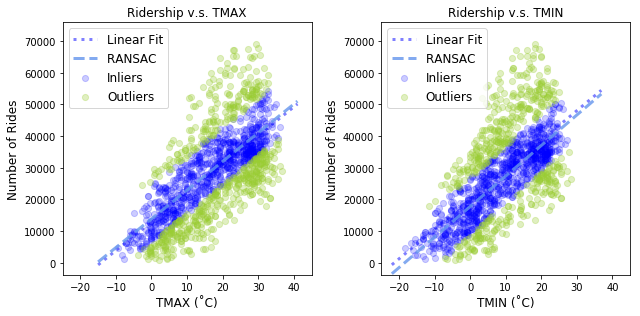
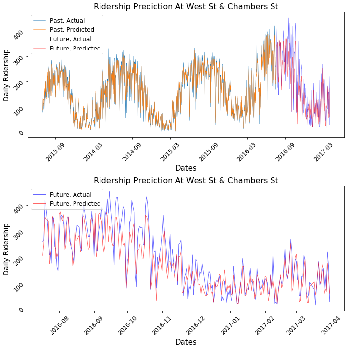
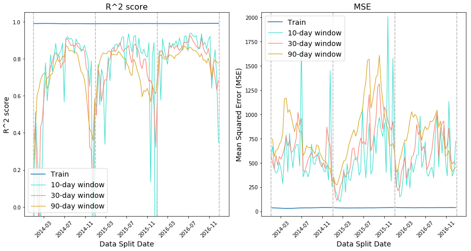
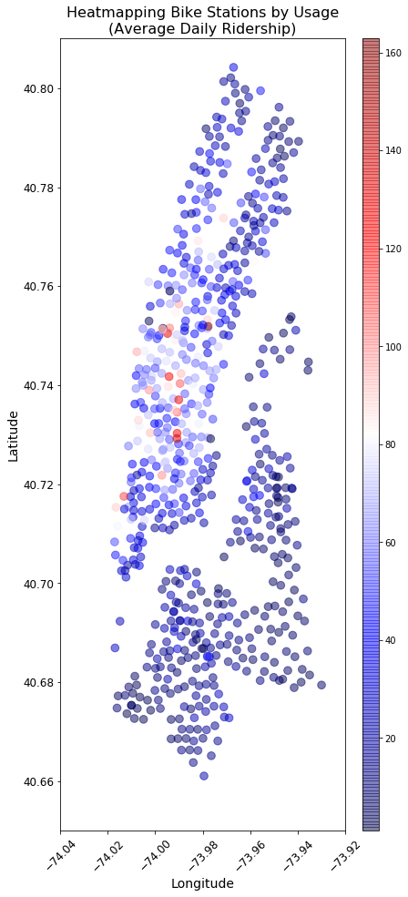

# capstone_report

This project folder contains all the Ipython notebooks containing codes for the
plots, figures, and analyses in my Capstone Report for Springboard
"Data Science Intensive" course.

- The PowerPoint file contains brief summary and results of the project
- Reports 01 to 12 contains codes for the main section
- Appendix 01 to 08 contains codes for the Appendix
- data_processing_codes folder contains codes used to wrangle the data
- my_scoring_functions.py in the main folder contains custom functions that were
used for evaluating machine learning models.

<b>Image Gallery</b> 
<i>Ridership vs Temperature</i> 

 
<i>Predicting Ridership</i> 

 
<i>Evaluating Model Performance</i> 

 

<i>Popular Stations</i> 

 
